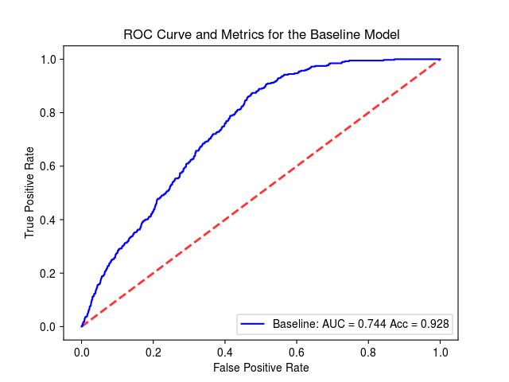
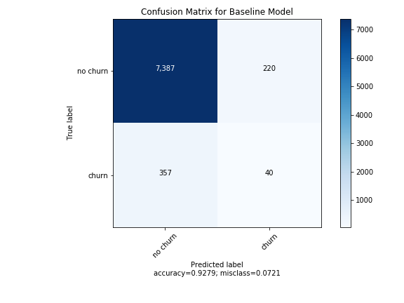

## Improving Customer Churn Modeling

#### Traditionally at BigTelco, customer churn has been predicted by a combination of [three variables](data/baseline.csv). Accuracy is good, but the ROC curve and the confusion matrix show room for improvement. This project uses an [expanded dataset](data/churndata.csv) and seeks to get better performance.

 

### -----------------------------Project Components-----------------------------

#### -------Model Deployment and Model Health Monitoring
* A Customer Churn Shiny App allows decision makers to review the likelihood to churn for any customer, along with explanations why. The app also displays model health data to track the performance of the model in production.
* A model health scheduled run executes daily and sends an email to project collaborators if any of the model inputs or outputs are "out of bounds".

#### -------Building the Model
* [DataPrep.ipynb](code/DataPrep.ipynb) ingests the new variables mentioned above, cleans and prepares the data. This is be scheduled to run on a weekly basis.
* [GB_ParamSearch.py](code/GB_ParamSearch.py) takes that prepared data and runs an experiment to determine the best loss function and # of estimators for the Gradient Boosting algorithm. The following are examples of how to make the call.
    - code/GB_ParamSearch.py exponential 10
    - code/GB_ParamSearch.py exponential 50
    - code/GB_ParamSearch.py deviance 10 
    - code/GB_ParamSearch.py deviance 50
    
    
* [Modeling.ipynb](code/Modeling.ipynb) tests the best Gradient Boosting algorithm against several others and saves that model as a pickle file.
* [predict.py](code/predict.py) loads the best model and builds a function used to create a real time API for churn prediction.
